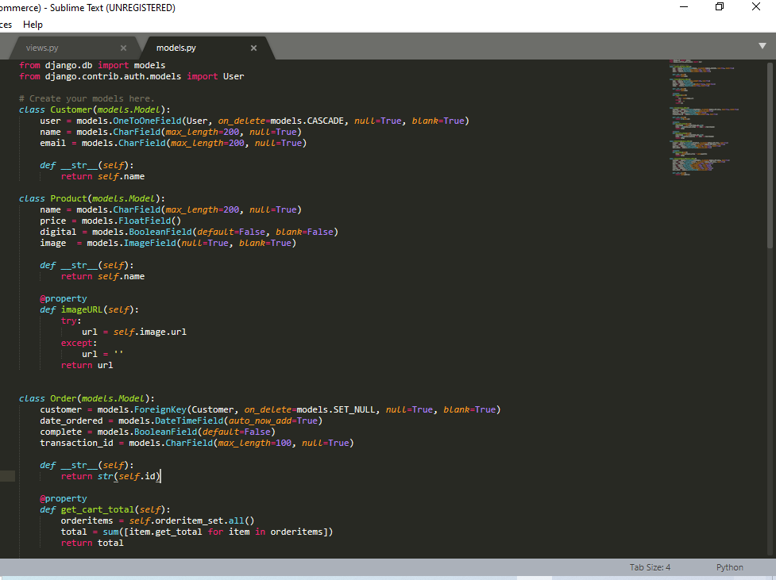

# Ecommerce_django
django_based_ecommerce_site

Ecommerce websites main attribute includes:

1.Store to showcase all the products.

2.Cart to collect all the articles.

3.Checkout to pay amount and to provide shipping address.

Store, Checkout, Cart pages are created using HTML template pages in django.

For each page the models are defined to implement add to cart, checkout actions.

The created models are migrated to the main python intialpage.

The built ecommerce templates are linked with the pages and the server is run through the fallowing commands

with the help of command promt from the main directory where the files are stored

manage.py runserver

#STORE django TEMPLATE

#CART django TEMPLATE

#Checkout django Template

with the help of models the products can be added easily.

[manage.py createsupersuser] command will make the user through the command promt and will help to access the admin page.

the models creted makes it easier to manage at the backend

The admin login pager

the admin dashboard

